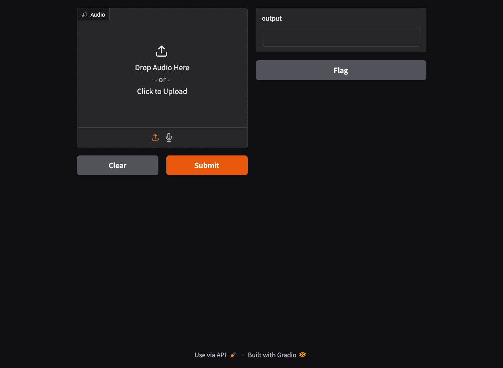

# `mlx-whisper` Web UI

Fast STT (Speach-to-Text) Web UI with mlx-whisper. The model is Whisper Large-3-Turbo.

## Prerequisites

- Apple Silicon Mac
- Python `>=3.12`
- uv `>=0.4.0`

## Usage

Install the packages.

```bash
uv sync
```

Run the app.

```bash
uv run main.py
```

Open http://127.0.0.1:7860 with your browse and you can view the app.



## Reference

- [mlx-whisper · PyPI](https://pypi.org/project/mlx-whisper/)
- [gradio · PyPI](https://pypi.org/project/gradio/)
- [openai/whisper: Robust Speech Recognition via Large-Scale Weak Supervision](https://github.com/openai/whisper)
